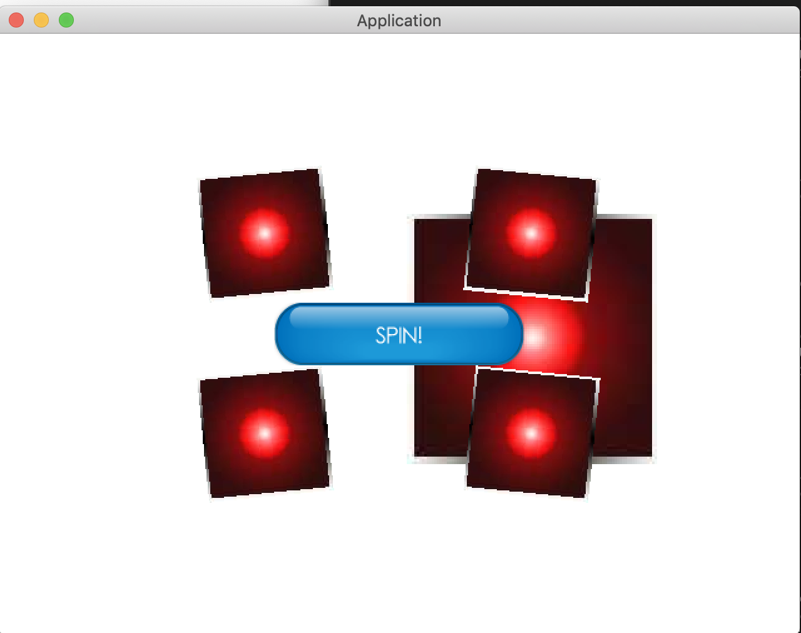

## Fonts and Labels 

LibGDX, game engine written in Java. KTX, Kotlin DSL for LibDGX. 

Seventh tutorial in the LibGDX series, adapted for Kotlin.

### About

If you are attempting to learn more about Kotlin and LibGDX this guide should be helpful! See previous solutions here: https://github.com/bajabob/libgdx-ktx-actions. This tutorial aims to teach you how to switch screens in LibGDX. 

### Uses 
 
TODO

### Screenshot

### How to Run

Clone or download a zip of the project

From the root of the project, execute: `./gradlew :desktop:run`